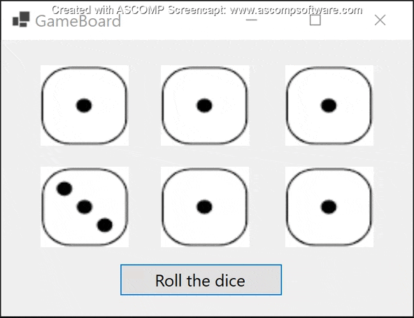

# Yahtzee-WFA

This is a Windows Forms App that has some dice rolling logic combined with display.

It was made for a CPTC course in C#. I added the UI to this project for fun.    

I used an image sprite for the die to improve my loading time.

